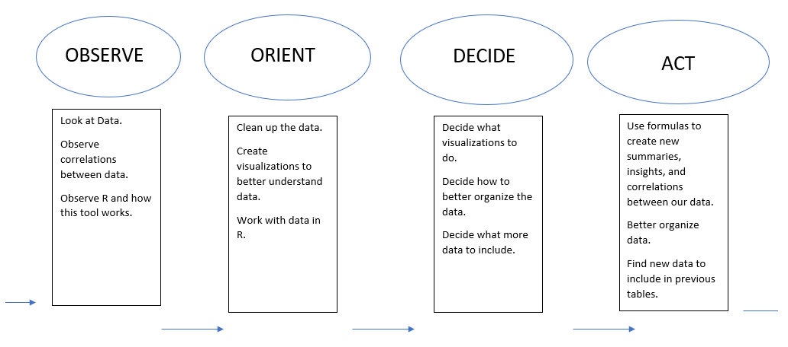

<!--
Document Hosted Here:
http://htmlpreview.github.io/?https://github.com/McKayMDavis/bi-analytics/blob/master/documents/proposal.html
-->

```{r}
knitr::opts_chunk$set(fig.width=12, fig.height=8) 
```


# Proposal
<hr/>

## Deliverables
Week 7:

1. Project Proposal
    + Together
2. Design Document
    + Brenden
3. Ensure installation of R is possible
    + McKay
4. Risks
    + McKay

Week 8:

1.  two cleaning methods each
    + Filtering (NA’s etc)
        + Brenden
    + Remove unnecessary columns
        + Brenden
    + Prepping secondary data for joins
        + McKay
    + Joins
        + McKay
2.	1 profiling example each
    + Summary of deaths by year and month
        + Brenden
    + Summary of deaths by intent (homicide and suicide) and race
        + McKay
3.	Installing R and RStudio
4.	Learning basics of R
5.	Pros and cons of cleaning and profiling in R
    + McKay
6.	List of things we learned

Week 9:

1.	Write up pros and cons of R to Excel
2.	2 patterns/visualizations/outliers each
    + Explorations of different variables in line graphs
3.	Pros and cons
4.	List of things we learned

Week 10:

1.	Pros and cons of R
2.	List of things we learned
3.	1 optimizing/forecasting/predicting model each
    + Trend prediction (shootings increasing by year in certain areas/races)
        + Brenden
    + Full regression analysis
        + McKay

## Description of Problem

With the hot topic of gun related crimes, we wanted to look at variables that contribute to a person being killed by a gun. We were specifically curious to look at school shootings, race fueled shootings, age, gender, etc.

## Dataset

https://www.kaggle.com/hakabuk/gun-deaths-in-the-us

## Risks

1.	New team that has never worked together before
    + Team meetings at least once per week
2.	New software to one team member
    + McKay will help Brenden learn skills in R to complete this analysis while building his understanding of packages required for this analysis.
3.	Limitations of data on types of models possible
    + Searching for more supplementary data that may allow for other types of models

## OODA Design



# Week 8
<hr/>

## Work Done

### R Tutorials (Brenden)

Extensive textbook available free online. I will continue to use this as a reference to questions I have.
[link](https://r4ds.had.co.nz/)
Basic functions, operators, etc.
[link](https://www.statmethods.net/r-tutorial/index.html)
Downloaded “swirl” tutorial in R and followed along in Rstudio. It taught me the basic operators and some functions. It taught me the basics of how statements work like how <- applies the following function to the object to the left of it.
McKay is experienced in R and has showed me a lot including some pipe statements, how to connect our scripts through git, and some neat functions like merge, summarise, and omit. We also learned together that the %<>% pipe statement might only work on the first line when there are multiple lines or another pipe beneath it.


### Regression Research and Pros/Cons (McKay)

1.	Regression Research
    + We are probably going to need to run a chi-squared test as the y variable is likely going to be categorical and non-binary. [click for source](https://stats.idre.ucla.edu/other/mult-pkg/whatstat/)
2.	Pros and Cons of R to Excel for cleaning and profiling
    + Pros
        + R code is modular and syntactically simple
        + R is capable of handling larger data sets with far greater speed
        + The user cannot physically touch the data and only touches states of the data, so there is not much room for accidentally deleting important things in the data.
        + R has many more tools available to it than Excel.
        + R is open source.
        + Streamlined data merges.
    + Cons
        + Data cannot be directly modified in its tabular form. This is difficult for beginners.
        + Pivot tables don’t exist (although similar summaries of any kind can be created with relative ease).
        + Excel is initially easier to use as most people have been exposed to similar Microsoft UI’s since they were five or from its inception.

## Week 8 Description of What We Did:

### Edits to Project Proposal:

1.	Changed cleaning methods and profiling to reflect what was needed
2.	Edited pros/cons to be McKay’s task (we still did some together)

### Methods:

We used the tidyverse package in R for reading in the data and cleaning it. We used different methods included in the package. During the cleaning process, we noticed an interesting column called `code` which ended up being a CDC code for the country of origin for hispanic people. We obtained a list of these codes and joined that with the original data.

Below is our code and outputs (Click toggle buttons on right to see code):

#### Setup

```{r, message=FALSE, warning=FALSE}
# libraries
library(tidyverse)
library(DT)
library(pander)

# Read in some data
guns <- read_csv("../data/guns.csv")
codes <- read_csv("../data/cdc_codes.csv", col_names = FALSE)
```


#### Original Data Samples

```{r, message=FALSE, warning=FALSE}
datatable(head(guns), options = list(dom = 't'))
datatable(head(codes), options = list(dom = 't'))
```


#### Cleaning Methods and Sample Clean Data

```{r, message=FALSE, warning=FALSE}
# Cleaning method 1: McKay
# Format codes data for joining on guns data
codes %<>%
  mutate(code = str_extract(X1, "[0-9]+"), 
         X1 = gsub("[0-9]+\\s", "", X1)) %>% 
  rename(type = X1)

# Cleaning method 2: McKay
# Join codes on guns
guns %<>%
  rename(code = hispanic) %>% 
  merge(codes)

# Cleaning method 3: Brenden
# Remove bad columns
guns <- guns %>%
  select(-code, -X1)

# Cleaning method 4: Brenden
# Remove NA Values
guns <- guns %>%
  na.omit()

datatable(head(guns), options = list(dom = 't'))
```


#### Profiling Methods

```{r, message=FALSE, warning=FALSE}
# Profiling method 1: Brenden
# Summary Table
count_gundeath <- guns %>%
  group_by(year, month) %>%
  summarise(n()) %>%
  rename(count = `n()`)

pander(count_gundeath)
```

```{r, message=FALSE, warning=FALSE}
# Profiling method 2: McKay
# Summary of deaths by intent and race (only Suicide and Homicide)
intents <- guns %>% 
  filter(intent %in% c("Homicide", "Suicide")) %>% 
  group_by(intent, race) %>% 
  summarise(count = n())

pander(intents)
```


# Week 9
<hr/>

### Edits to Project Proposal:

This week, we simply re-evaluated what types of charts were possible. We ended up doing line graphs but exploring different variables. We also did one pie chart.

### Links to Training Material:

* (https://www.r-graph-gallery.com)
* (https://ggplot2.tidyverse.org)

### Pros/Cons:

After spending a couple weeks with R, I have found some Pros and Cons with R as opposed to using Excel. One is that R has a much steeper learning curve but that once learned, can be quicker at doing many tasks than excel can. One of the biggest Pros that I found with R so far is that when you run functions it actually writes the information into the outcome. You can’t do this in excel very easily. For example, the functions in excel are referential and has to reference a cell that continues to exist as long as you want that function to operate properly. In R, as long as your dataset exists somewhere in your project, your script will be able to use the data in your functions. I have also seen that R is much faster at calculating data than excel typically is.

### Methods:

For our visualizations, we used the `ggplot2` package in R (part of the `tidyverse` created by Hadley Wickham). This package lends a myriad of useful tools for controlling every aspect of a plot. We also incorporated some base-graphics stuff with our pie chart, as well as interactive plots using `plotly` (Unfortunately these won't work without being dynamically hosted). We largely worked on these together. We had to do a little more cleaning to make this work.

#### McKay's Visualizations

```{r, message=FALSE, warning=FALSE}
guns %<>%
  mutate(date = zoo::as.yearmon(paste0(year, "-", month)),
         is_minority = case_when(race != "White" ~ "Minority",
                                 race == "White" ~ "White")) %>% 
  mutate(education2 = case_when(education == 1 ~ "Less Than Highschool",
                                education == 2 ~ "Graduated From Highschool or equivalent",
                                education == 3 ~ "Some College",
                                education == 4 ~ "At Least College Graduate",
                                education == 5 ~ "Unknown"))
```


```{r, message=FALSE, warning=FALSE}
guns %>% 
  group_by(date, is_minority, intent) %>% 
  summarise(count = n()) %>% 
  filter(intent %in% c("Homicide", "Suicide")) %>% 
  ggplot(aes(x = date, y = count, color = intent, group = intent)) +
  geom_point() +
  geom_line() +
  facet_wrap(~is_minority) +
  theme(axis.text.x = element_text(angle = 90, hjust = 1)) +
  theme_minimal() +
  scale_color_brewer(palette = "Set2") +
  labs(y = "Number of Gun Deaths",
       x = "Date",
       color = "Intent",
       title = "Number of Deaths between Minority and White by Intent")
```

```{r, message=FALSE, warning=FALSE}
guns %>% 
  group_by(date, education2, intent) %>% 
  filter(intent %in% c("Homicide", "Suicide"),
         education != 5) %>% 
  summarise(count = n()) %>%
  ungroup() %>% 
  ggplot(aes(x = date, y = count, color = education2, group = education2)) +
  geom_point() +
  geom_line() +
  facet_wrap(~intent) +
  theme(axis.text.x = element_text(angle = 90, hjust = 1)) +
  theme_minimal() +
  scale_color_brewer(palette = "Set2") +
  labs(y = "Number of Gun Deaths",
       x = "Date",
       color = "Education Level",
       title = "Number of Deaths by Suicide Proportionately Higher for Higher Educated People")
```

#### Brenden's Visualizations

```{r, message=FALSE, warning=FALSE}
guns %>%
  mutate(date = zoo::as.Date(date)) %>%
  group_by(date, intent) %>%
  summarise(count = n()) %>%
  ungroup() %>% 
  group_by(intent) %>% 
  mutate(avg = mean(count)) %>% 
  ggplot(aes(x = date, y = count, color = intent, group = intent)) +
  geom_line() + geom_point() +
  geom_line(aes(y = avg), color = "black") +
  theme(axis.text.x = element_text(angle = 90, hjust = 1)) +
  scale_x_date(date_labels = "%b %y",date_breaks = "1 month")
```

```{r, message=FALSE, warning=FALSE}
guns %>%
  mutate(date = zoo::as.Date(date)) %>%
  group_by(date, race) %>%
  summarise(count = n()) %>%
  ungroup() %>% 
  group_by(race) %>% 
  mutate(avg = mean(count)) %>% 
  ggplot(aes(x = date, y = count, color = race, group = race)) +
  geom_line() + geom_point() +
  geom_line(aes(y = avg), color = "black") +
  theme(axis.text.x = element_text(angle = 90, hjust = 1)) +
  scale_x_date(date_labels = "%b %y",date_breaks = "1 month")
```

```{r, message=FALSE, warning=FALSE}
pie_guns <- guns %>%
  group_by(intent) %>%
  summarise(count = n())
  
pie(pie_guns$count, pie_guns$intent)
```

# Week 10
<hr/>

### Edits to Project Proposal

1. Brenden did logistic regression
2. McKay did Chi-Square test

### Links to Training Materials

1. https://proquestcombo-safaribooksonline-com.byui.idm.oclc.org/book/databases/9781118661468/10-moving-from-spreadsheets-into-r/chap10_sec004_html

2. http://www.sthda.com/english/wiki/chi-square-test-of-independence-in-r

### Pros/Cons

1. Pros
    + Substantially more tools to choose from
    + Readily available packages and algorithms
    + Time to run same analysis is not even comparable--R is much faster
    + Capable of analyzing substantially more rows of data without slowing down
2. Cons
    + Must learn programming language
  
### Methods

We had to ponder our data for a bit to understand what we could do with it. We ended up running a logistic regression on the race (minority or not) as the y variable and intent as the x variable. We also used Chi-Square to show us a break down of the different races when compared with intent. The two analyses show similar results.

### Logistic Regression

```{r, message=FALSE, warning=FALSE}
guns_an <- guns %>%
  mutate(is_minority2 = case_when(is_minority == "Minority" ~ 1,
                                  is_minority == "White" ~ 0))


guns_glm <- glm(is_minority2 ~ intent,
                    data = guns_an,family = binomial("logit"))

pander(summary(guns_glm))
```

Based on the above results, we could conclude that Accidental, Homicide, and Suicide are all significant predictors of race. This is kind of a weird conclusion when you think about it. What this means is that if a person committed suicide, we might be able to predict their race accurately with this model.

### Chi-Square

```{r}
guns_chi <- chisq.test(guns$intent, guns$race)
pander(guns_chi)
```

The results of the Chi-Square test indicate that some variable combinations have significantly higher counts than the others. If we look at the breakdown below, we can see which ones.

```{r}
pander(guns_chi$observed)
```
  
Whites have a count of 55363 for suicide, which is over 10 times more than the next highest count. Blacks have a count of 19145 for homicide, which is over 5 times more than the next highest. This means that if we were to get word of a suicide, we might (within some level of error) accurately predict that it is a white person that has died.

### Conclusion

Are these ethical variables to look at when conducting this type of study? Probably not, however we were able to find significant differences and predictors within the data, which was pretty cool.

